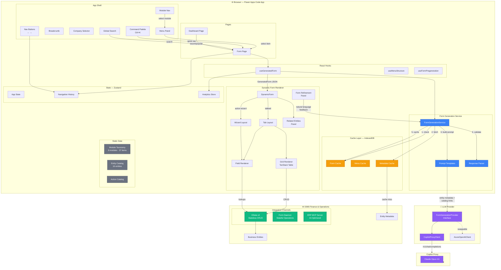

# Architecture

```mermaid
graph TB
    subgraph Browser["🌐 Browser — Power Apps Code App"]
        subgraph Shell["App Shell"]
            MN[Module Nav]
            MP[Menu Panel]
            BC[Breadcrumb]
            CS[Company Selector]
            GS[Global Search]
            CP[Command Palette<br/>Ctrl+K]
            NB[Nav Buttons<br/>← →]
        end

        subgraph Pages["Pages"]
            DP[Dashboard Page]
            FP[Form Page]
        end

        subgraph FormRenderer["Dynamic Form Renderer"]
            DF[DynamicForm]
            TL[Tab Layout]
            WL[Wizard Layout]
            GR[Grid Renderer<br/>TanStack Table]
            FR[Field Renderer]
            RP[Related Entities<br/>Panel]
            RF[Form Refinement<br/>Panel]
        end

        subgraph Hooks["React Hooks"]
            UGF[useGeneratedForm]
            UMS[useMenuStructure]
            UFP[useFormPregeneration]
        end

        subgraph Generation["Form Generation Service"]
            FGS[FormGenerationService]
            PT[Prompt Templates]
            RSP[Response Parser]
        end

        subgraph State["State — Zustand"]
            AS[App State]
            NH[Navigation History]
            AN[Analytics Store]
        end

        subgraph Cache["Cache Layer — IndexedDB"]
            FC[Form Cache]
            MC[Menu Cache]
            MDC[Metadata Cache]
        end

        subgraph Data["Static Data"]
            MT[Module Taxonomy<br/>8 modules · 37 items]
            EC[Entity Catalog<br/>16 entities]
            AC[Action Catalog]
        end
    end

    subgraph LLM["🧠 LLM Provider"]
        LI[FormGenerationProvider<br/>Interface]
        CPC[CopilotProxyClient]
        AOC[AzureOpenAIClient]
    end

    subgraph Proxy["Copilot Proxy<br/>127.0.0.1:8080"]
        OPUS[Claude Opus 4.6]
    end

    subgraph D365["⚙️ D365 Finance & Operations"]
        subgraph Channels["Integration Channels"]
            OD[OData v4<br/>Stateless CRUD]
            FD[Form Daemon<br/>Stateful Operations]
            MCP[ERP MCP Server<br/>AI-Optimized]
        end
        META[Entity Metadata]
        ENTITIES[Business Entities]
    end

    %% User Flow
    MN -->|select module| MP
    MP -->|select item| FP
    CP -->|quick nav| FP
    GS -->|search| FP
    DP -->|recent/popular| FP

    %% Form Generation Flow
    FP --> UGF
    UGF --> FGS
    FGS -->|1. check| FC
    FGS -->|2. fetch| MDC
    MDC -->|cache miss| META
    FGS -->|3. build prompt| PT
    PT -->|entity metadata +<br/>catalog hints| LI
    LI --> CPC
    CPC -->|/v1/chat/completions| Proxy
    Proxy --> OPUS
    FGS -->|4. validate| RSP
    FGS -->|5. cache| FC

    %% Form Rendering
    UGF -->|GeneratedForm JSON| DF
    DF -->|tabbed| TL
    DF -->|action wizard| WL
    TL --> FR
    TL --> GR
    WL --> FR
    DF --> RP
    RF -->|natural language<br/>feedback| FGS

    %% Data Flow
    GR -->|CRUD| OD
    OD --> ENTITIES
    FR -->|lookups| OD

    %% State
    FP --> NH
    NB --> NH
    UGF --> AN

    %% Alternative LLM
    LI -.->|swappable| AOC

    %% Styling
    classDef primary fill:#3b82f6,stroke:#1e40af,color:#fff
    classDef accent fill:#8b5cf6,stroke:#5b21b6,color:#fff
    classDef green fill:#10b981,stroke:#047857,color:#fff
    classDef orange fill:#f59e0b,stroke:#b45309,color:#fff
    classDef gray fill:#6b7280,stroke:#374151,color:#fff

    class FGS,PT,RSP primary
    class OPUS,CPC,LI accent
    class OD,FD,MCP green
    class FC,MC,MDC orange
    class MT,EC,AC gray
```
